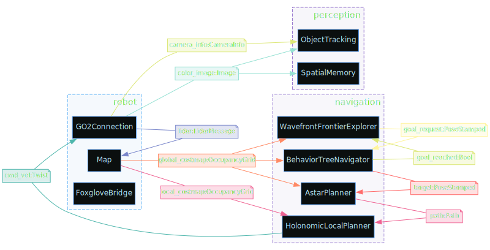

# Dimos Modules

Module is a subsystem on a robot that operates autonomously and communicates to other subsystems.
Some examples of are:

- Webcam (outputs image)
- Navigation (inputs a map and a target, outputs a path)
- Detection (takes an image and a vision model like yolo, outputs a stream of detections)

etc

## Example Module

```python session=camera_module_demo ansi=false
from dimos.hardware.camera.module import CameraModule
#from dimos.core.introspection.module import dot
print(CameraModule.io())
#dot.render_svg(CameraModule.module_info(), "{output}")
```

<!--Result:-->
```
┌┴─────────────┐
│ CameraModule │
└┬─────────────┘
 ├─ color_image: Image
 ├─ camera_info: CameraInfo
 │
 ├─ RPC start() -> str
 ├─ RPC stop() -> None
 │
 ├─ Skill video_stream (stream=passive, reducer=latest_reducer, output=image)
```

We can see that camera module outputs two streams:

color_image with [sensor_msgs.Image](https://docs.ros.org/en/melodic/api/sensor_msgs/html/msg/Image.html) type
camera_info with [sensor_msgs.CameraInfo](https://docs.ros.org/en/melodic/api/sensor_msgs/html/msg/CameraInfo.html) type

As well as offers two RPC calls, start and stop, and a tool for an agent called video_stream (about this later)

We can easily start this module and explore it's output

```python session=camera_module_demo ansi=false
import time

camera = CameraModule()
camera.start()
# now this module runs in our main loop in a thread. we can observe it's outputs

print(camera.color_image)

camera.color_image.subscribe(print)
time.sleep(1)
camera.stop()
```

<!--Result:-->
```
Out color_image[Image] @ CameraModule
Image(shape=(480, 640, 3), format=RGB, dtype=uint8, dev=cpu, ts=2025-12-12 17:06:30)
Image(shape=(480, 640, 3), format=RGB, dtype=uint8, dev=cpu, ts=2025-12-12 17:06:30)
Image(shape=(480, 640, 3), format=RGB, dtype=uint8, dev=cpu, ts=2025-12-12 17:06:30)
Image(shape=(480, 640, 3), format=RGB, dtype=uint8, dev=cpu, ts=2025-12-12 17:06:31)
```

## Connecting modules

```python ansi=false
from dimos.perception.detection.module2D import Detection2DModule, Config
print(Detection2DModule.io())
```

<!--Result:-->
```
 ├─ image: Image
┌┴──────────────────┐
│ Detection2DModule │
└┬──────────────────┘
 ├─ detections: Detection2DArray
 ├─ annotations: ImageAnnotations
 ├─ detected_image_0: Image
 ├─ detected_image_1: Image
 ├─ detected_image_2: Image
 │
 ├─ RPC start() -> None
 ├─ RPC stop() -> None
```

TODO: add easy way to print config

looks like detector just needs an image input!

```python ansi=false
import time
from dimos.perception.detection.module2D import Detection2DModule, Config
from dimos.hardware.camera.module import CameraModule

camera = CameraModule()
detector = Detection2DModule()

detector.image.connect(camera.color_image)

camera.start()
detector.start()

detector.detections.subscribe(print)
time.sleep(3)
detector.stop()
camera.stop()
```

<!--Result:-->
```
Detection(Person(1))
Detection(Person(1))
Detection(Person(1))
Detection(Person(1))
```

## Blueprints

Blueprint is a structure of interconnected modules. basic unitree go2 blueprint looks like this,

```python  session=blueprints output=go2_standard.svg
from dimos.core.introspection.blueprint import dot2, LayoutAlgo
from dimos.robot.unitree_webrtc.unitree_go2_blueprints import basic, standard, agentic

dot2.render_svg(standard, "{output}")
```

<!--Result:-->

